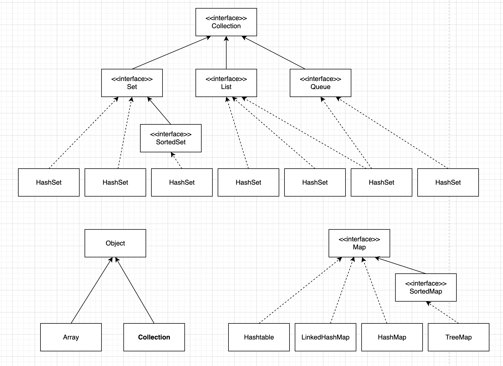
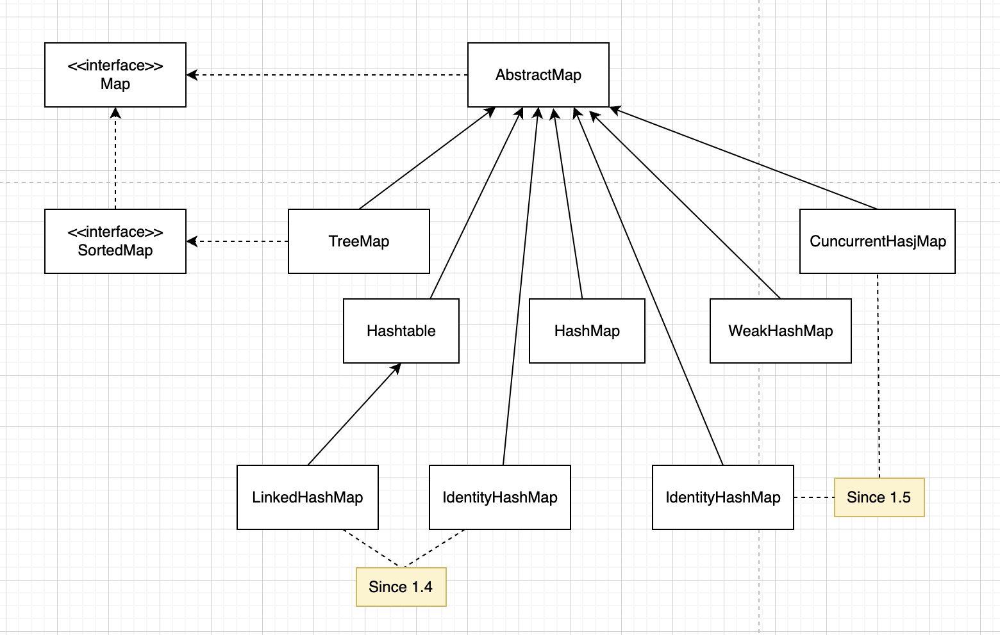

# Collections
 

> 본 내용은 한빛미디어에서 출간한 책(개발자 기술 면접 노트)의 일부 내용을 보강하기 위해서 만든 Collection Framework 가이드 입니다.<br>
> 책의 분량상 코드나 이론등의 내용을 다 담아내지 못하였기에 문서로 추가적인 설명을 진행합니다.<br> 
> 설명에서는 타이핑을 줄이기 위해서 존대를 생략했으니 양해 바랍니다.<br>
> 만약 내용에 문제가 있거나 오/탈자가 있을 경우 villainscode@gmail.com으로 메일 부탁드립니다.
>
>
> - Instagram - [https://www.instagram.com/codevillains](https://www.instagram.com/codevillains)
> - email - [villainscode@gmail.com](mailto:villainscode@gmail.com)
> - Yes24 - https://www.yes24.com/Product/Goods/125554439
> - KyoboBooks - https://product.kyobobook.co.kr/detail/S000212738756

* [책 소개](#----)
  + [[연봉의 앞자리를 바꾸는] 개발자 기술면접 노트](#--------------------------)
- [Collection Framework의 기본 개념](#collection-framework-------)
- [1. 자바의 자료구조](#1---------)
- [2. Collection 인터페이스](#2-collection------)
  * [2-1 List 인터페이스](#2-1-list------)
  * [2-2 Set 인터페이스](#2-2-set------)
- [3. Collection의 기본 생성 방법](#3-collection----------)
- [4. Collection 의 사용](#4-collection-----)
  * [4-1 ArrayList 예제](#4-1-arraylist---)
  * [4-2 LinkedList 예제](#4-2-linkedlist---)
  * [4-3 HashSet 예제](#4-3-hashset---)
  * [4-4 LinkedHashSet 예제](#4-4-linkedhashset---)
  * [4-5 TreeSet 예제](#4-5-treeset---)
- [5. Map](#5-map)
  * [5-1 Map과 관련된 클래스들](#5-1-map----------)
  * [5-2 HashMap 클래스](#5-2-hashmap----)
  * [5-3 TreeMap클래스](#5-3-treemap---)
  * [5-4 LinkedHashMap 클래스](#5-4-linkedhashmap----)
  * [5-5 Hashtable 클래스](#5-5-hashtable----)
- [6. Collection의 활용 예제](#6-collection-------)
- [7. Collection 을 이용한 데이터의 정렬](#7-collection--------------)
  * [7-1 정렬](#7-1---)
  * [7-2 Collections.sort()를 이용한 정렬](#7-2-collectionssort----------)
  * [7-3 Arrays.sort() 를 이용한 정렬](#7-3-arrayssort-----------)
  * [7-4 Comparable 과 Comparator를 통한 정렬 구현](#7-4-comparable---comparator----------)
  * [7-5 Multi Column 에 대한 정렬 처리](#7-5-multi-column-----------)
- [*Tip. 한글, 영문, 숫자순으로 정렬*](#-tip------------------)

<small><i><a href='http://ecotrust-canada.github.io/markdown-toc/'>Table of contents generated with markdown-toc</a></i></small>


## 책 소개
### [연봉의 앞자리를 바꾸는] 개발자 기술면접 노트 
- 2024.03.25, 한빛미디어, 이남희(codevillain) 저


> **신입 및 주니어 개발직군의 취업 및 이직을 위한 가이드** 
> 
> 서류 작성 방법부터 , 유망한 회사를 찾는 방법, 코딩 테스트와 기술 면접을 준비하기 위해 알아야 할 개념들을 어떤 방식으로 접근해야 하는지 설명했습니다.
> 
> 특히 면접에서 면접관이 던지는 질문의 의도와 해당 질문에 올바르게 답변하기 위한 실질적인 대처방법에 대해서 기술하였습니다. 
> 아울러 기술면접을 넘어 인성면접에서 가져야할 마음가짐과 리더십 원칙, 정답이 없는 질문에 대처하기 위한 사례들을 소개하였습니다.
> 
> 취업 및 이직의 상황에서 본인이 준비하고 있는 방향이 맞는지 점검하고 커리어 패스를 어떻게 설계해야 하는지 실천 가능한 방법을 제시함으로서 도움을 주고자 하였습니다.   


# Collection Framework의 기본 개념


# 1. 자바의 자료구조


Java는 기본타입(원형, Primitive 타입 또는 원시형이라고도 한다)의 자료 이외에도 String 이나 배열(참조형 타입, Reference Type)이 존재한다.
참조형 타입은 객체의 메모리 주소를 참조하여 데이터를 처리하며, 클래스 기반으로 생성된다. 예를 들어, String은 자바의 기본 라이브러리에 포함된 클래스로 문자열을 표현하고 다루고, 배열도 참조형 타입에 속하며 여러 개의 값을 연속적인 메모리 공간에 저장하여 관리하고자 할때 사용된다. 이러한 참조형 타입은 힙 메모리 영역에 할당되고, 가비지 컬렉션의 대상이 된다.
이 밖에도 데이터를 효율적으로 저장하고 처리할 수 있는 Collection 타입도 존재한다.


콜렉션 프레임워크는 java.util 패키지 안에 위치하며, 여러 인터페이스와 이를 구현하는 클래스로 구성 되어있다. 
주요 컬렉션 인터페이스는 다음과 같다:

> - List: 순서가 있는 데이터의 집합을 다루며, 데이터 중복을 허용. ArrayList, LinkedList 등이 있다.
> - Set: 순서를 유지하지 않고, 중복을 허용하지 않는 데이터 집합. HashSet, LinkedHashSet, TreeSet 등이 있다.
> - Queue: FIFO(First In First Out) 방식 또는 우선 순위에 따라 데이터를 처리하는 인터페이스. LinkedList, PriorityQueue등이 이에 속한다.
> - Map: 키(Key)와 값(Value)의 쌍으로 데이터를 저장. 키는 중복될 수 없으며, 각 키는 하나의 값만을 가리킨다. HashMap, TreeMap, LinkedHashMap 등이 있다.

콜렉션 프레임워크에 대해서는 본 문서에서 중점적으로 설명한다. 

설명에 앞서 배열을 먼저 살펴보자.  

기본적으로 int 타입이나 String 타입의 자료들을 여러건 담기 위해서는 배열을 선언하여 사용하게 된다.

아래의 샘플코드를 살펴보자

```java
int[] ids;
int[] ids = new int[5];

String[] userInfoArray = new String[10];
String[] userInfoArray = new String[] {"one", "two"};
```

위의 구문은 배열의 선언부이다.

배열의 길이를 확인하기 위해서는 **int arrayLength = userInfoArray.length;** 와 같이 사용하여 확인할 수 있습니다.

배열의 요소에 대해서는 반복 접근을 통해 확인 할 수 있다.

```java
for (int I = 0; I < userInfoArray.length; i++) {
    String s = userInfoArray[i];
}
```

또, System.arraycopy(src, srcPos, dest, destPos, length)와 같은 메서드를 통해 배열을 복사 할 수 있으며, java.util.Arrays.sort 를 이용하여 정렬을 수행할 수 도 있다.

배열을 쓰는 이유는 아래와 같다.

- 데이터 접근과 사용이 매우 효율적(특정 요소에 대한 접근이 매우 빠름)
- Type-safe : 배열에 선언된 데이터 타입만 추가될수 있음
- 구현이 간단함

반면, 단점은 아래와 같다.

- 고정 크기, 복사와 크기 재조정에 오버헤드 존재
- 배열안에 몇 개의 데이터가 있는지 일일이 검사해야함
- 콜렉션에 비해 제한된 기능, 좀 더 범용적인 기능이 필요함

이 같은 이유 때문에 좀 더 다이내믹한 데이터 타입인 Collection을 정확히 이해하고 사용하는 것을 알아보고자 한다.

# 2. Collection 인터페이스

Collection은 객체들을 모아둔 자료 구조체를 나타내는 개념이다.

모든 Collection의 상위 인터페이스로써 Collection들이 갖고 있는 핵심 메서드를 선언한다.

List 와 Set 인터페이스가 모두 Collection 인터페이스를 상속하고 있으므로 핵심적인 자료구조에서의 연산이 Collection 인터페이스에 정의 되어 있음을 알수 있다

Collection 동작 방식을 이해하려면 Collection 인터페이스가 정의하는 메서드들을 살펴보는 것이 가장 좋을 것이다.
이 인터페이스는 java.util 패키지에 위치해 있으며, 컬렉션을 다루기 위한 다음과 같은 주요 메소드를 포함하고 있다.

> - boolean add(E e): 지정된 요소를 컬렉션에 추가한다.
> - boolean remove(Object o): 지정된 요소를 컬렉션에서 제거한다.
> - boolean contains(Object o): 지정된 요소가 컬렉션에 포함되어 있는지 여부를 반환한다.
> - int size(): 컬렉션 내의 요소 수를 반환한다.
> - boolean isEmpty(): 컬렉션이 비어 있는지 여부를 반환한다.
> - Iterator<E> iterator(): 컬렉션의 요소를 반복하는 데 사용할 반복자를 반환한다.
> - void clear() : 컬랙션을 비운다. 


Collection 하위로 Set 계열(`TreeSet`, `SortedSet`, `LinkedHashSet`, `HashSet`)과 List 계열(`ArrayList`, `LinkedList`, `Vector`)등이 있으며 이와는 별도로 Map 계열(`SortedMap`, `TreeMap`, `HashMap`, `Hashtable`)이 존재한다.
<br>
Map은 Collection을 확장하지 않았지만 Collection의 한 부분으로 분류하여 사용한다.

이 외에도 Queue와 Deque가 있다.(큐와 덱의 차이나 구현 방법에 해서는 책에 더 자세히 설명 되어있다.)


아래의 이미지를 통해 Collection 인터페이스의 전반적인 상속과 구현에 대해서 이해할 수 있을 것이다.
주요 구현 클래스들은 다음과 같다.




> ArrayList: 크기 조절이 가능한 배열로 구현된 리스트.
>
> LinkedList: 이중 연결 리스트로 구현된 리스트 및 큐.
>
> HashSet: 해시 테이블에 의해 구현된 집합.
>
> LinkedHashSet: 순서를 유지하는 해시 테이블에 의해 구현된 집합.
>
> TreeSet: 이진 검색 트리에 의해 구현된 정렬된 집합.
>
> PriorityQueue: 우선순위 힙에 의해 구현된 큐.
>
> ArrayDeque: 배열을 기반으로 한 덱.
>

## 2-1 List 인터페이스


Collection 인터페이스를 확장한 자료형으로 요소들의 순서를 저장하여 색인(Index)을 사용하여 특정 위치에 요소를 삽입하거나 접근할 수 있다. 중복을 허용하고 인덱스로 접근한다. 가변형 배열과 비슷하다.

정리하면 다음과 같다. 

> 순서 유지: 요소가 삽입된 순서를 유지한다. <br>
> 인덱스 기반 접근: 인덱스를 사용하여 특정 위치의 요소에 접근할 수 있다. <br>
> 중복 허용: 동일한 요소를 여러 번 저장할 수 있다.


- List로 사용할 수 있는 클래스 : ArrayList, LinkedList , Vector 등이 존재한다.
- ArrayList
  - 내부적으로 동적 배열을 사용한다.
      - 상당히 빠르고 크기를 마음대로 조절할 수 있는 배열
      - 요소의 접근 속도가 빠르며, 랜덤 엑세스가 효율적이다.
  - 단방향 포인터 구조로 자료에 대한 순차적인 접근에 강점이 있음
  - 요소의 삽입과 삭제가 상대적으로 느릴 수 있다. 
- Vector
    - ArrayList의 구형 버전. 모든 메서드가 동기화되어 있음(thread safe)
    - 느려서 잘 쓰이진 않음
- LinkedList
    - 이중 연결 리스트로 구현 
    - 양방향 포인터 구조로 데이터의 삽입, 삭제가 빈번할 경우 빠른 성능을 보장.
      - 요소의 접근 속도는 상대적으로 느림 
    - 스택, 큐, 양방향 큐 등을 만들기 위한 용도로 쓰임
- CopyOnWriteArrayList
  - 쓰기 시 새로운 배열을 생성하여 스레드에 안전한 리스트를 구현
  -   읽기 작업은 매우 빠르지만, 쓰기 작업은 상대적으로 느림.


다음의 활용 코드를 살펴보자. (src 하위의 java/main에서 각 인터페이스들의 메서드를 사용한 예제들을 확인할 수 있다. com.codevillains.collection.method 패키지 참조 )

```java
/**
 * @author CodeVillains
 * @description : ArrayList 전체 메서드 기능을 사용해본다. 
 */
package com.codevillains.collection.method;

import java.util.ArrayList;
import java.util.List;
import java.util.ListIterator;

public class ArrayListMethodExample {
  public static void main(String[] args) {
    // List 인터페이스를 ArrayList 구현 클래스로 사용
    List<String> list = new ArrayList<>();

    // 요소 추가
    list.add("Apple");
    list.add("Banana");
    list.add("Cherry");
    System.out.println("최초 list: " + list);

    // 요소 삽입
    list.add(1, "Orange");
    System.out.println("요소 삽입 인덱스 1,  'Orange' : " + list);

    // 컬렉션 추가
    List<String> additionalFruits = new ArrayList<>();
    additionalFruits.add("Grape");
    additionalFruits.add("Watermelon");
    list.addAll(additionalFruits);
    System.out.println("collection 추가 : " + list);

    System.out.println("2번째 요소 가져오기 : " + list.get(2));

    // 요소 수정
    list.set(2, "Grapes");
    System.out.println("2번째 요소 변경 : " + list);

    // 요소 삭제 (인덱스로)
    String removedElement = list.remove(3);
    System.out.println("3번째 요소 삭제: " + removedElement);
    System.out.println("3번째 요소 삭제 후 collection: " + list);

    // 요소 삭제 (객체로)
    boolean isRemoved = list.remove("Banana");
    System.out.println("바나나 삭제 여부: " + isRemoved);
    System.out.println("바나나 삭제 후 collection: " + list);

    // 리스트 크기
    System.out.println("List 사이즈: " + list.size());

    // 리스트 비어 있는지 확인
    System.out.println("리스트가 비어있는지 확인? " + list.isEmpty());

    // 요소 포함 여부 확인
    boolean containsApple = list.contains("Apple");
    System.out.println("사과과 포함되어 있나? " + containsApple);

    // 리스트 반복
    System.out.println("list iterating :");
    for (String fruit : list) {
      System.out.println(fruit);
    }

    // 리스트 반복자 사용
    ListIterator<String> listIterator = list.listIterator();
    System.out.println("list 반복자 사용 :");
    while (listIterator.hasNext()) {
      System.out.println(listIterator.next());
    }

    // 하위 리스트 가져오기
    List<String> subList = list.subList(1, 3);
    System.out.println("SubList index 1부터 3까지: " + subList);

    // 리스트 초기화
    list.clear();
    System.out.println("list 초기화: " + list);
    System.out.println("리스트가 비어있나? " + list.isEmpty());
  }
}

```
각 메서드에 대해서 이해하는 것은 어렵지 않을 것이다. 

## 2-2 Set 인터페이스


집합을 정의하며 요소의 중복을 허용하지 않는다. 스스로 정의한 메서드는 없다. (상위 메서드를 사용)

- Set 으로 사용할 수 있는 클래스 : HashSet, LinkedHashSet, TreeSet등이 존재.
- HashSet
    - 가장 빠른 임의 접근 속도
    - 순서를 전혀 예측할 수 없음
- LinkedHashSet
    - 추가된 순서, 또는 가장 최근에 접근한 순서대로 접근 가능
- TreeSet
    - 정렬된 순서대로 보관. 정렬 방법을 지정할 수 있음

# 3. Collection의 기본 생성 방법


Java 1.5 Generic 방식이 나온 후 로 아래와 같이 Collection을 생성할 수 있게 되었다.

```java
List<String> list= new ArrayList<String>();
List <String> userList= new ArrayList <String> (5);
Map<String, Object> userMap= new HashMap<String, Object> ();
Set<String> userSet= new HashSet<String> ();
```

위 방식은 Java 1.5 버전이 나오고 Generic 가 추가 된 이후 코드라서 예시로써 작성했지만 현재의 코드 준수 솔루션은 `java.util.Collections` 를 사용하는 것이다.

일반적인 빈 Collection 객체를 반환해야 한다면 아래의 코드를 사용하여 리턴해줄 수 있다.

```java
List<User> list = Collections.EMPTY_LIST();       // 비권장  
Map<String, Object> maps = Collections.EMPTY_MAP; // 비권장 
Set<String> sets = Collections.EMPTY_SET;         // 비권장 

// 1.5 Generic 으로 인하 List<T> 반환하기 때문에 타입 안정성을 보장할 수 있다.
List<User> collection1 = Collections.emptyList();
Map<String, String> collection2 = Collections.emptyMap();
Set<String> collection3 = Collections.emptySet();
```

List<User> list = Collections.EMPTY_LIST()의 경우 컴파일러가 타입 체크를 하지 않아 타입 불일치 문제나 에러가 발생할 여지가 있어서 Collections.emptyList()를 반환하는 것으로 권장한다. Collections.emptyList() 는 불변객체로써 값을 추가 할 수 없기 때문에 빈 객체를 리턴하는 경우에나 사용 가능하다.

아래의 Collections.java 구현 내용을 보면 금방 이해할 수 있을 것이다.

```java
public static final <T> List<T> emptyList() {
    return (List<T>) EMPTY_LIST;
}

...
public static final List EMPTY_LIST = new EmptyList<>();
```

Collections.EMPTY_LIST() 메서드가 반환하는 객체는 List 타입으로만 사용할 수 있다는 것을 확인 할 수 있다.

# 4. Collection 의 사용

Collection 인터페이스는 java.lang 패키지의 Iterable<T>를 extends 하고 있는 root 인터페이스로, List, Set, Queue와 Map 인터페이스를 통해 다양한 자료형을 제공하고 있다.

몇가지 주요 인터페이스에 대해서 정리해보면,

- List 인터페이스:
  List 인터페이스는 순서가 있는 요소의 집합을 나타내며, 중복 요소가 허용된다. List 인터페이스는 Collection 인터페이스를 확장하고 구현클래스로는 ArrayList, LinkedList, Vector 등이 있다.
- Set 인터페이스:
  Set 인터페이스는 중복되지 않는 요소의 집합을 나타내며, 순서는 유지되지 않는다. Set 인터페이스를 구현하는 클래스로는 HashSet, TreeSet 등이 있다.
- Queue 인터페이스:
  Queue 인터페이스는 요소의 삽입과 삭제가 발생하는 선입선출(FIFO) 구조의 컬렉션을 나타낸다. Queue 인터페이스를 구현하는 클래스로는 PriorityQueue, ArrayDeque 등이 있다.
- Map 인터페이스:
  Map 인터페이스는 키-값(key-value) 쌍으로 이루어진 요소의 집합을 나타낸다. Map 인터페이스는 Collection 인터페이스를 직접 확장하지는 않지만, Collection 인터페이스와 많은 공통 메서드를 공유한다. Map 인터페이스를 구현하는 클래스로는 HashMap, TreeMap 등이 있다.

아래는 각 인터페이스들을 확장한 자료형들의 사용방법에 대한 예제이다.

## 4-1 ArrayList 예제


ArrayList 클래스는 AbstractList를 확장하고 List 인터페이스를 구현하여 필요에 따라 길이가 늘어나는 동적 배열을 지원한다. (증가 감소 가능) ArrayList의 생성과 사용방법에 대해서 예제를 살펴보도록 하자.

```java
/**
 * @author CodeVillains
 * @description : ArrayList 간단 활용 데모 
 */
package com.codevillains.collection;

import java.util.ArrayList;
import java.util.List;

class ArrayListDemo {
	public static void main(String args[]) {

		// 배열 리스트를 만든다. 
		List<String> al = new ArrayList<>();
		System.out.println("Initial size of al: " + al.size());
		
		// 배열 리스트에 요소들을 추가한다. 
		al.add("C"); 
		al.add("A"); 
		al.add("E");
		al.add("B");
		al.add("D");
		al.add("F");
		al.add(1, "A2");  // index 1에 A2 값을 추가함 
		System.out.println("Size of al after additions: " + al.size());
		
		// 배열 리스트를 출력한다. 
		System.out.println("Contents of al: " + al);
		
		// 배열 리스트에서 요소들을 삭제한다. 
		al.remove("F"); 
		al.remove(2);
		
		System.out.println("Size of al after deletions: " + al.size());
		System.out.println("Contents of al: " + al);
	}
}
```

위의 코드 10라인에서 String 타입의 ArrayList를 생성했다. List는 인터페이스이기 때문에 구현체를 통해 생성을 하였고 초기 값은 당연이 없으므로 size 를 반환하면 0이 리턴될 것이다.

20라인에서 애초에 추가한 요소 인덱스 1(인덱스는 0부터 시작)에 A2 라는 값을 추가 해주었고 출력해보면 인덱스 1 이후에 값은 순차적으로 밀린것을 확인할 수 있다.(삽입)

요소를 remove 하기 위해서는 값을 입력하거나 인덱스를 통해서 가능하게 된다.

결과는 아래와 같다.

```
Initial size of al: 0
Size of al after additions: 7
Contents of al: [C, A2, A, E, B, D, F]
Size of al after deletions: 5
Contents of al: [C, A2, E, B, D]
```

만약, 잘못된 요소에 접근할 경우 (이미 지운 값을 또 지우려 한다거나, 삽입되지 않은 값을 찾는다거나...) java.lang.IndexOutOfBoundsException 이 발생하게 된다.

ArrayList는 간단하게 toArray()를 통하여 배열로 변환할 수 있다.

아래의 예제를 살펴보자.

```java
/**
 * @author CodeVillains
 * @description : ArrayList to Array 
 */
package com.codevillains.collection;

import java.util.ArrayList;
import java.util.List;

class ArrayListToArray {
	public static void main(String args[]) {

		// 배열 리스트를 만든다. 
		List<Integer> al = new ArrayList<>();
		// 배열 리스트에 요소를 추가한다. 
		al.add(new Integer(1)); 
		al.add(new Integer(2));
		al.add(new Integer(3)); 
		al.add(new Integer(4));
		System.out.println("Contents of al: " + al); 
		
		// 배열을 얻는다. 
		Object ia[] = al.toArray(); 
		int sum=0;
		
		// 배열 요소들의 합계를 구한다. 
		for(int i=0; i<ia.length; i++){
			sum += ((Integer) ia[i]).intValue();
		}			
		
		System.out.println("Sum is: " + sum);
	}
}
```

18 라인에서 ArrayList 의 toArray를 통해 배열로 반환함을 확인 할 수 있다.

결과를 살펴보면 아래와 같다.

```
Contents of al: [1, 2, 3, 4]
Sum is: 10
```

ArrayList 의 주요 메서드는 아래와 같습니다. 굉장히 자주 사용되는 메서드이므로 꼭 기억해야 한다.

| 메서드 | 설명 |
| --- | --- |
| add(Object elem) | ArrayList에 요소를 추가 |
| remove(int index) | index 에 위치하는 요소 제거 |
| remove(Object elem) | elem과 일치하는 요소 제거 |
| contains(Object elem) | elem을 포함하고 있으면 true 아니면 false |
| isEmpty() | ArrayList 가 비어있으면 true 비어있지 않으면 false |
| indexOf(Object elem) | elem과 일치하는 요소의 index를 리턴, 없으면 -1 |
| size() | ArrayList의 요소의 개수를 리턴 |
| get(int index) | index에 위치한 요소를 리턴 |
| clear() | ArrayList를 비움(모든 요소를 삭제) |

## 4-2 LinkedList 예제

이 클래스는 AbstractSequentialList를 확장하고 List 인터페이스를 구현한다.

연결-리스트 자료 구조를 제공하고 리스트의 처음과 마지막에 요소를 삽입, 삭제할 수 있는 관련 메서드를 제공한다.

```java
/**
 * @author CodeVillains
 * @description : LinkedList
 */
package com.codevillains.collection;

import java.util.LinkedList;

public class LinkedListDemo {

	public static void main(String args[]) {
		// 링크드 리스트를 생성.
		LinkedList<String> ll = new LinkedList<String>();
		
		// 링크드 리스트에 요소를 추가한다. 
		ll.add("F"); 
		ll.add("B"); 
		ll.add("D");
		ll.add("E"); 
		ll.add("C"); 
		ll.addLast("Z"); 
		ll.addFirst("A");
		
		ll.add(1, "A2"); 
		
		System.out.println("Original contents of ll: " + ll);
		
		// 링크드 리스트에서 요소를 삭제한다.
		ll.remove("F"); 
		ll.remove(2);
		
		System.out.println("Contents of ll after deletion: " + ll);
		
		// 첫 번째와 마지막 요소를 삭제한다. 
		ll.removeFirst(); 
		ll.removeLast(); 
		System.out.println("ll after deleting first and last: " + ll);
		
		// 값을 가져오고 값을 설정한다. 
		Object val = ll.get(2); 
		ll.set(2, (String) val + " Changed");
		
		System.out.println("ll after change: " + ll);	
	}
}
```

실행 결과는 아래와 같다.

```
Original contents of ll: [A, A2, F, B, D, E, C, Z]
Contents of ll after deletion: [A, A2, D, E, C, Z]
ll after deleting first and last: [A2, D, E, C]
ll after change: [A2, D, E Changed, C]
```

실제 LinkedList가 implements 받은 Interface는 List, Deque, Cloneable 정도 인데, List의 주요 메서드들을 사용할 수 있기 때문에 요소의 추가 삭제등은 동일하게 사용할 수 있다.

눈여겨 볼만한 주요 메서드는 addFirst, addList, getFirst, getLast, removeFirst, removeLast 등 이다.

랜덤하게 특정한 인덱스를 호출하여 데이터를 가져올 경우 혹은 삭제할 경우 ArrayList가 성능상으로 좀 더 좋고, LinkedList는 리스트의 처음과 끝에 요소를 제거하거나 삽입하기에 더 큰 잇점이 있다

Set 인터페이스 예제를 설명하기 전에, Collection 인터페이스를 구현한 클래스들에 대해서 간단히 정리하고 넘어가보자.

**Collection 인터페이스를 구현한 클래스**

- AbstractCollection : Collection 인터페이스의 대부분을 구현한다.
- AbstractList : AbstractCollection을 확장하고 List 인터페이스의 대부분을 구현한다.
- AbstractSequentialList : 요소들에 무작위 접근보다는 순차적인 접근을 사용하는 컬렉션을 사용하기 위해서 AbstractList를 확장한다.
- LinkedList : AbstractSequentialList를 확장함으로써 링크드 리스트를 구현 한다.
- ArrayList : AbstractList를 확장함으로써 동적 배열을 구현한다.
- AbstractSet : AbstractCollection을 확장하고 Set 인터페이스의 대부분을 구현한다.
- HashSet : 해시 테이블과 함께 사용하기 위해서 AbstractSet을 확장한다.
- LinkedHashSet : 삽입 순서가 있는 반복을 허용하기 위해 HashSet을 확장한다.
- TreeSet : 트리에 저장된 집합을 구현한다. AbstractSet을 확장한다.

## 4-3 HashSet 예제


HashSet 클래스는 AbstractSet을 확장하고 Set 인터페이스를 구현한다.

HashSet은 기억장소로 해시 테이블을 사용하는 컬렉션을 만들고, 해시 테이블을 해싱(hashing)이라 불리는 기술을 사용해서 정보를 저장한다. 중복을 허용하지 않고, 해싱을 하는 과정이 보통의 정렬된 집합을 생성하는데 알맞지 않기 때문에 요소들의 순서를 보장해주지 않는다.

아래는 간단한 예제이다.

```java
/**
 * @author CodeVillains
 * @description : HashSet 데모 
 */
package com.codevillains.collection;

import java.util.HashSet;
import java.util.Set;

public class HashSetDemo {

	public static void main(String args[]) {
		// 해시 집합을 생성한다. 
		Set<String> hs = new HashSet<>();
		// 해시 집합에 요소를 추가한다. 
		hs.add("B"); 
		hs.add("A"); 
		hs.add("D");
		hs.add("E"); 
		hs.add("C"); 
		hs.add("F");
		
		System.out.println(hs);
	}
}
```

보통의 경우 순서를 보장하지 않기 때문에 무작위로 나올 것을 기대하지만 사용하는 자바 플랫폼에 따라서 내부 구현에 의해 오름차순으로 출력되는 경우도 발생할 수 있으나 이는 Java 나 HashSet의 클래스 명세에 보장하는 것은 아니다. 만약 요소의 순서가 보장되는 것이 중요하다면 LinkedHashSet 클래스를 사용해야 한다.

LinkedHashSet 클래스는 내부 구현이 해시 테이블과 연결 리스트를 결합한 것으로, 요소들이 추가된 순서를 유지한다. 따라서 LinkedHashSet 클래스를 사용하면 요소들이 추가된 순서대로 출력되는 것을 보장할 수 있다.

## 4-4 LinkedHashSet 예제


HashSet을 확장했지만 자신의 메서드는 추가되지 않는다. 위에 설명한데로 HashSet과는 다르게 삽입된 순서대로 반복 출력이 가능하다.

```java
/**
 * @author CodeVillains
 * @description : LinkedHashSet
 */
package com.codevillains.collection;

import java.util.LinkedHashSet;
import java.util.Set;

class LinkedHashSetDemo {
	public static void main(String[] args) {
		Set<String> linkHashSet = new LinkedHashSet<String>();
		linkHashSet.add("B");
		linkHashSet.add("A");
		linkHashSet.add("D");
		linkHashSet.add("E");
		linkHashSet.add("C");
		linkHashSet.add("F");
		System.out.println(linkHashSet);
	}
}
```

처리결과

```
[B, A, D, E, C, F]
```

## 4-5 TreeSet 예제

트리를 사용하는 Set 인터페이스의 구현을 제공한다.

오름차순 정렬로 저장되며 많은 양의 데이터를 저장하는데 효과적이고 검색속도가 매우 빠르다는 장점이 있다.

```java
/**
 * @author CodeVillains
 * @description : TreeSet 데모 
 */
package com.codevillains.collection;

import java.util.Set;
import java.util.TreeSet;

public class TreeSetDemo {
	public static void main(String[] args) {
		// 트리 집합을 만든다. 
		Set<String> ts = new TreeSet<String>();
		// 트리 집합에 요소들을 추가한다. 
		ts.add("C"); 
		ts.add("A"); 
		ts.add("B");
		ts.add("E"); 
		ts.add("F"); 
		ts.add("D");
		System.out.println(ts);
	}
}
```

처리결과

```
[A, B, C, D, E, F]
```

# 5. Map
Map은 Key-Value 쌍의 데이터를 저장하는 인터페이스이다. Key를 통해 Value를 검색하고 추가, 삭제하는 등의 작업을 수행할 수 있다.

Map 인터페이스를 구현하는 클래스로는 HashMap, TreeMap 등이 있고 특징은 아래와 같다.

- HashMap : 순서를 보장하지 않지만, 검색과 추가, 삭제 등의 작업에서 매우 빠르게 처리할 수 있다.
- TreeMap : 정렬된 순서로 데이터를 처리할 수 있지만, 검색과 추가, 삭제 등의 작업에서는 HashMap보다 느릴 수 있다.
- LinkedHashMap : 데이터의 추가 순서를 유지한다. HashMap보다는 느리지만 데이터 추가 순서를 보장할 수 있는 장점이 있다.
- WeakHashMap : Key가 가비지 컬렉션의 대상이 될 때마다 해당 Key와 Value가 자동으로 삭제된다. 메모리 누수를 방지하기 위해 사용된다.
- EnumMap : EnumMap은 Key가 Enum 타입인 Key-Value 쌍의 데이터를 저장하는 맵 구조를 제공한다. Key가 Enum 타입이기 때문에 (내부적으로 ordinal이라는 순차적인 정수값을 가지므로) 키 순서가 보장된다.



Map은 쉽게 생각하면 사물함의 열쇠와 같은 개념이라고 볼 수 있다. 사물함의 번호와 키가 일치하면 해당 키로 사물함을 열고, 물건을 넣거나 빼올 수 있을 것이다.
를
사물함이 방대하다면 키에 사물함의 번호만 확인 가능하게 해주면 원하는 위치로 바로 가서 사물함을 조작할 수 있기 때문에 속도측면에서 이득을 가질 것이다.

- 하나의 사물함 열쇠가 다른 사물함까지 열수 있다면 이것은 문제가 되듯 Map에서도 키는 유일(Unique) 해야한다.
- Map에는 순서가 없다 - List와 Set이 순서나 집합적인 개념의 인터페이스라면 Map은 검색의 개념이 가미된 인터페이스이다.
- Map 인터페이스는 데이터를 삽입할 때 Key와 Value의 형태로 삽입되며, Key를 이용해서 Value를 얻을 수 있다.
- Map은 순서가 없다.

간단한 사용 예제 코드를 살펴보자.

```java
/**
 * @author CodeVillains
 * @description : Map 데모 
 */
package com.codevillains.collection;

import java.util.Collection;
import java.util.HashMap;
import java.util.Map;
import java.util.Set;

public class MapDemo {

	public static void main(String[] args) {
		Map<Integer, String> map = new HashMap<Integer, String>();
		
		// Key : 회원번호 , value : 이름 - map.put을 이용하여 데이터를 저장한다. 
		map.put(1, "홍길동이");
		map.put(2, "Samsig");
		map.put(3, "Harunote");
		map.put(100, "Kakao");

		System.out.println(map);
		System.out.println(map.get(100));

		// 값 찾기 (Key 혹은 Value) 존재하면 True
		System.out.println(map.containsKey(3));
		System.out.println(map.containsValue("Samsig"));

		
		// 키를 Set에 담기, Key는 Integer 로 정의 되어있다. 
		Set<Integer> keys = map.keySet();
		System.out.println(keys);

		
		// 값을 Collection에 담기, Value는 String으로 정의 되어있다. 
		Collection<String> values = map.values();
		System.out.println(values);

	}
}

```

처리 결과를 살펴보자.

```
{1=홍길동이, 2=Samsig, 3=Harunote, 100=Kakao}
Kakao
true
true
[1, 2, 3, 100]
[홍길동이, Samsig, Harunote, Kakao]
```

Map 은 Key 와 Value 의 쌍으로 데이터 타입이 정의 되어있고, Key는 중복될 수 없다고 했다.

물론, Key 에 대응하는 Object 타입의 빈을 정의 해서 사용해도 무방하다.

예를들어 UserVO의 UserName 과 UserMail 주소로 키가 형성이 된다면 `map.put(new UserVO(UserName, UserMail), value)` 형태로도 키를 구성할 수 있다.

맵과 관련된 주요 인터페이스는 아래와 같다.

맵은 컬렉션 인터페이스를 구현하지 않기 때문에 컬렉션은 아니지만 entrySet 메서드를 이용하여 맵의 컬렉션 뷰를 얻을 수 있다.

만약 key의 컬렉션 뷰를 얻기 위해서는 keySet 메서드를 이용하면 됩니다. 값에 대한 콜렌션 뷰는 values 메서드로 가능하다.

| 인터페이스 | 설명 |
| --- | --- |
| Map | 유일한 키와 값을 연결(map)한다. |
| Map.Entry | 맵에 있는 요소(키/값 쌍)을 표현한다. Map 인터페이스의 내부 클래스이다. |
| SortedMap | 키를 오름차순으로 유지하기 위해서 Map 인터페이스를 확장한다. |

## 5-1 Map과 관련된 클래스들


AbstractMap이 모든 실제 맵 구현의 최상위 클래스이다.

| 클래스 | 설명 |
| --- | --- |
| AbstractMap | Map 인터페이스의 대부분을 구현한다. |
| HashMap | 해시 테이블을 사용하기 위해서 AbstractMap을 확장한다. |
| TreeMap | 트리를 사용하기 위해서 AbstractMap을 확장한다. |
| WeakHashMap | 취약 키(weak key)를 갖는 해시 테이블을 사용하기 위해서 AbstractMap을 확장한다. |
| LinkedHashMap | 삽입-순서 반복을 허용하기 위해서 HashMap을 확장한다. |
| IdentityHashMap | AbstractMap을 확장하고 요소(document)를 비교할 때 참조가 같은지 비교한다. |

## 5-2 HashMap 클래스


Map인터페이스를 구현하기 위해 해시테이블을 사용한 클래스로. 중복을 허용하지 않고 순서를 보장하지 않는다.

Map인터페이스를 구현한 클래스 중에서 가장 많이 쓰인다*.*

key 또는 value 값으로써 null이 허용된다.

```java
/**
 * @author CodeVillains
 * @description : HashMap 데모 
 */
package com.codevillains.collection;

import java.util.HashMap;
import java.util.Iterator;
import java.util.Map;
import java.util.Set;

public class HashMapDemo {

	public static void main(String args[]) {
		// 해시 맵을 만든다. 
		Map<String, Double> hm = new HashMap<String, Double>();
		// 맵에 요소들을 넣는다. 
		hm.put("홍길동이", new Double(1240.34)); 
		hm.put("김영순이", new Double(223.39)); 
		hm.put("퀵군", new Double(1378.00)); 
		hm.put("글라이더님", new Double(9999.55)); 
		hm.put("존 도", new Double(-122.08));
		hm.put("한효주님", null);
		
		// 맵 엔트리의 컬렉션 집합을 가져온다. 
		Set<?> set = hm.entrySet();
		
		// 반복자를 얻는다. 
		Iterator<?> i = set.iterator();
		
		// 요소들을 출력한다. 
		while(i.hasNext()) {
			Map.Entry me = (Map.Entry)i.next();
			System.out.print(me.getKey() + ": ");
			System.out.println(me.getValue());
		} 
		
		// 존 도의 계좌에 1000을 예금한다. 
		double bonus = hm.get("존 도").doubleValue(); 
		hm.put("존 도", new Double(bonus + 1000)); 
		System.out.println("존 도's new deposit: " + hm.get("존 도"));
		
	}
}

```

처리결과는 아래와 같다.

```
퀵군: 1378.0
한효주님: null
홍길동이: 1240.34
글라이더님: 9999.55
존 도: -122.08
김영순이: 223.39
존 도's new deposit: 877.92
```

HashMap 의 주요 메서드는 아래와 같다.

| 메서드 | 설명 |
| --- | --- |
| void clear() | HashMap에 저장된 모든 객체를 제거. |
| Object clone() | 현재 HashMap을 복제하여 반환. |
| boolean containsKey(Object key) | HashMap에 지정된 키(key)가 포함되어 있으면 true 리턴 |
| boolean containsValue(Object key) | HashMap에 지정된 값(value)가 포함되어 있으면 true 리턴 |
| Set entrySet() | HashMap에 저장된 키와 값을 엔트리(키와 값의 결합)의 형태로 Set에 저장하여 반환. |
| Object get(Object key) | 지정된 키(Key)의 값(객체)을 반환. |
| boolean isEmpty() | HashMap이 비어 있는지 확인. |
| Set keySet() | HashMap에 저장된 모든 키가 저장된 Set을 반환. |
| Object put(Object key, Object value) | HashMap에 키와 값을 저장. |
| void putAll(Map m) | Map에 해당하는 모든 요소를 HashMap에 저장. |
| Object remove(Object key) | HashMap에서 지정된 키로 저장된 값(객체)를 제거. |
| int size() | HashMap에 저장된 요소의 개수를 반환 |

## 5-3 TreeMap클래스

이진검색트리의 형태로 키와 값의 쌍으로 이루어진 데이터를 저장한다.

정렬된 순서로 키/값 쌍을 저장하므로 빠른 검색을 가능하게 한다는 장점이 있다.

해시맵과는 달리, 트리맵은 요소들이 키의 오름차순으로 저장 됩니다. 또한 저장시 정렬도 같이 하기 때문에 저장시간이 다소 오래 걸린다.

아까의 예제를 TreeMap으로 변형하여 작성해보도록 하자.

```java
/**
 * @author CodeVillains
 * @description : TreeMap 데모 
 */
package com.codevillains.collection;

import java.util.Iterator;
import java.util.Map;
import java.util.Set;
import java.util.TreeMap;

public class TreeMapDemo {

	public static void main(String args[]) {
		// 해시 맵을 만든다. 
		Map<String, Double> tm = new TreeMap<String, Double>();
		// 맵에 요소들을 넣는다. 
		tm.put("홍길동이", new Double(1240.34)); 
		tm.put("김영순이", new Double(223.39)); 
		tm.put("퀵군", new Double(1378.00)); 
		tm.put("글라이더님", new Double(9999.55)); 
		tm.put("존 도", new Double(-122.08));
		tm.put("한효주님", null);
		
		// 맵 엔트리의 컬렉션 집합을 가져온다. 
		Set<?> set = tm.entrySet();
		
		// 반복자를 얻는다. 
		Iterator<?> i = set.iterator();
		
		// 요소들을 출력한다. 
		while(i.hasNext()) {
			Map.Entry me = (Map.Entry)i.next();
			System.out.print(me.getKey() + ": ");
			System.out.println(me.getValue());
		} 
		
		// 존 도의 계좌에 1000을 예금한다. 
		double bonus = tm.get("존 도").doubleValue(); 
		tm.put("존 도", new Double(bonus + 1000)); 
		System.out.println("존 도's new deposit: " + tm.get("존 도"));
		
	}
}
```

결과를 출력해보면 Key 의 오름차순으로 출력됨을 알수 있다.

```
글라이더님: 9999.55
김영순이: 223.39
존 도: -122.08
퀵군: 1378.0
한효주님: null
홍길동이: 1240.34
존 도's new deposit: 877.92
```

## 5-4 LinkedHashMap 클래스


LinkedHashMap은 기본적으로 HashMap을 상속받았기 때문에 HashMap과 매우 흡사합니다. 차이점은 Map에 있는 엔트리들의 연결 리스트를 유지한다는 점이다. 즉, Map에 저장된 삽입-순서로 반복하는것을 가능하게 해준다.

똑같은 예제를 LinkedHashMap 타입으로 변경하여 테스트 해보자.

입력받은 순서대로 출력됨을 확인 할 수 있다.

## 5-5 Hashtable 클래스

HashMap보다는 느리지만 동기화가 지원된다. HashMap 과는 다르게 null 값은 허용하지 않습니다.

HashMap 에 동기화 블럭을 통해 코딩한 경우(Collections.synchronizedMap(new HashMap(...))) 보다는 속도가 빠르다고 알려져 있다.

아래의 예제를 실행해보도록 하자.

```java
/**
 * @author CodeVillains
 * @description : Hashtable 데모 
 */ 
package com.codevillains.collection;


import java.util.Enumeration;
import java.util.Hashtable;

public class HashTableDemo {

	public static void main(String args[]) {
		// Create a hash map
		Hashtable<String, Double> ht = new Hashtable<String, Double>();
		Enumeration<String> names;
		String str;

		ht.put("홍길동이", new Double(1240.34));
		ht.put("김영순이", new Double(223.39));
		ht.put("퀵군", new Double(1378.00));
		ht.put("글라이더님", new Double(9999.55));
		ht.put("존 도", new Double(-122.08));
		ht.put("한효주님",  new Double(55.77));

		names = ht.keys();
		while (names.hasMoreElements()) {
			str = (String) names.nextElement();
			System.out.println(str + ": " + ht.get(str));
		}
		System.out.println();

		double bonus = ((Double) ht.get("존 도")).doubleValue();
		ht.put("존 도", new Double(bonus + 1000)); 
		System.out.println("존 도's new deposit: " + ht.get("존 도"));
	}
}
```

실행결과 살펴보면 아래와 같다.

```
글라이더님: 9999.55
퀵군: 1378.0
한효주님: 55.77
존 도: -122.08
김영순이: 223.39
홍길동이: 1240.34

존 도's new deposit: 877.92
```

- Hashtable, HashMap의 공통점
    - 내부적으로 모두 *Hash* 기법을 이용한다
    - *Map* 인터페이스를 구현하고 있다
    - *Key*와 *Value*를 이용해서 *Data*를 관리한다
- Hashtable, HashMap의 차이점
    - *Hashtable*은 동기화가 보장된다
    - *HashMap*은 동기화가 보장되지 않는다
    - *HashMap*의 동기화 지원 방법 : Map m = Collections.synchronizedMap(New HashMap(...));
- Hashtable, HashMap과 HashSet과의 관계
    - *Hashtable*과 *HashMap*은 둘 다 *Map* 인터페이스를 구현하고 있다
    - *HashSet*은 내부적으로 *Hash*기법을 사용하지만 *Set*인터페이스를 구현하고 있다

| 특징 | HashMap | Hashtable |
| --- | --- | --- |
| 객체 생성 방법 | Map map = new HashMap(); | Map hashtable = new Hashtable(); |
| 주요 특징 | 단일스레드 환경에서 사용하기 좋은 자료구조 | 멀티스레드 환경에서 사용하기 좋은 자료구조 (synchronized 가 붙어있다.)
thread-safe 하지만 hashmap 보다 느리다. |

# 6. Collection의 활용 예제

Collection을 통해 자주 쓰는 메서드를 활용하여 예제를 만들어보았다. 결과가 어떻게 나오는지 살펴보자.

```java
package com.codevillains.collection;
/**
 * @author CodeVillains
 */
import java.util.*;

public class AlgorithmsDemo {

	public static void main(String args[]) {

		// 링크드 리스트를 만들고 초기화한다.
		LinkedList<Integer> ll = new LinkedList<Integer>();
		ll.add(new Integer(-8));
		ll.add(new Integer(20));
		ll.add(new Integer(-20));
		ll.add(new Integer(8));

		// 역순의 비교자를 생성.
		Comparator<Integer> r = Collections.reverseOrder();

		// 비교자를 사용해서 리스트를 정렬한다.
		Collections.sort(ll, r);

		// 반복자를 얻는다.
		Iterator<Integer> li = ll.iterator();

		System.out.print("List sorted in reverse: ");
		while (li.hasNext()) {
			System.out.print(li.next() + " ");
		}

		System.out.println();

		Collections.shuffle(ll);

		// 임의의 리스트를 표시한다.
		li = ll.iterator();
		System.out.print("List shuffled: ");

		while (li.hasNext()) {
			System.out.print(li.next() + " ");
		}
		System.out.println();

		System.out.println("Minimum: " + Collections.min(ll));
		System.out.println("Maximum: " + Collections.max(ll));

	}
}
```

Collections 클래스에는 정렬이나 순서 조합을 위한 다양한 메서드들을 지원합니다.

| 메서드 | 설명 |
| --- | --- |
| Collections.copy(list, list) | 컬렉션 요소들을 복사한다. |
| Collections.reverse(list) | list 요소의 순서를 반대로 변경한다. |
| Collections.reverseOrder() | list 요소의 순서를 역순으로 정렬힌다. |
| Collections.shuffle(list) | list 순서를 변경힌다.(Shuffle) |
| Collections.sort(list) | list 를 정렬힌다. |
| Collections.min(list) | list 의 요소중 가장 작은값을 반환한다. |
| Collections.max(list) | list 의 요소중 가장 큰 값을 반환한다. |

다음 강좌에서 정렬에 대해서는 다시 예제로 설명할 예정이다.

실행 결과는 shuffle 에 따라 다소 다르겠지만 아래와 같다.

```
List sorted in reverse: 20 8 -8 -20 
List shuffled: -8 8 20 -20 
Minimum: -20
Maximum: 20
```

자료구조의 구분이나 컬렉션의 계층도, 맵 계열의 계층도를 통해 좀 더 상속이나 구현관계를 이해할 수 있어야 하며, 내부 활용 메서드들은 빈번하게 사용되므로 꼭 한번쯤 정리 해보기를 바란다.

# 7. Collection 을 이용한 데이터의 정렬

개발을 하다보면 다양한 요구사항에 직면하게 된다. 비단 고객사의 요구사항에 맞춰 개발하는 SI에 국한된것이 아니라 제품을 만들때 화면 레벨에서 Ajax 와 같은 Asyc 처리시에 URL 호출 후 내려 받은 데이터들을 DB를 억세스 하지 않고 정렬 알고리즘을 적용해야 하는 상황이 온다면 Collection Framework 을 이용하여 충분히 해결할 수 도 있다.

## 7-1 정렬


정렬 (Sort) - 배열 되어 있는 자료들을 큰 순서, 작은 순서로 재 배열 하는 것을 말한다. 일반적인 알고리즘에서 기본적으로 알아야 할 개념들은 아래와 같다.

- 선택 정렬 (Selection Sort) : 주어진 리스트에서 최소값을 찾아 맨 앞에 위치값과 비교하여 교체한다. 목록의 각 위치에 대해서 이러한 과정을 계속한다.

  `O(n^2) 의 퍼포먼스가 나온다.`

- 버블 정렬 (Bubble Sort) : 구성 요소를 순회하면서 인접한 두개의 원소를 비교하여 자리를 교환하는 방식으로 반복하며 정렬을 완성한다. 뒤에 값이 작으면 앞으로 위치를 바꿔줘야 해서 가변공간이 하나 필요하다.

  `퍼포먼스가 비효율적이다. 최악의 경우 역순으로 정렬하려고 할 때 O(n^2)가 나오고 최선은 리스트가 이미 정렬이 되어있을 경우 O(N)의 성능이 나온다.`

- 퀵 정렬 (Quick Sort) : 따로 메모리를 사용하지 않는다. 현재 있는 메모리 안에서 정렬하기 때문에 효율이 좋다.

  기준값을 중심으로 완족 부분 집합과 오른쪽 부분 집합으로 분할 한 후 왼쪽엔 작은값을, 오른쪽엔 기준값 보다 큰 값을 이동시킨다. 이런 방식을 순환적으로 반복하여(각각 quick sort로 리컬시브하게 연산) 정렬을 완성한다.

  `퍼포먼스는 O(n log n), worst case O(n^2) : 이미 정렬된 상태에서 실행할 경우`

- 삽입 정렬 (Insertion Sort) : 삽입 정렬, 배열의 모든 요소를 앞에서부터 차례대로 이미 정렬된 배열 부분과 비교하여, 자신의 위치를 찾아 삽입함.

  대상을 기준값의 왼쪽 요소부터 비교해서 기준값의 크기가 비교값보다 작을 경우 두개의 위치를 바꿔주고 기준값을 저장한다. (반복하면서 정렬)

  `O(n^2) 의 퍼포먼스가 나온다.`

- 병합 정렬 (Merge Sort) : (Divide & Conquer) : 안정적인 정렬

  주워진 배열을 두 부분씩 나누워 정렬한 후 하나로 합치는 방식

  두 번의 재귀 호출과 한 번의 합병으로 구성되며 재귀 호출 시 배열 크기가 절반으로 줄어 들어 깊이가 log n 으로 된다.

  즉, 두 배열의 합은 두 배열의 크기의 합에 비례 함으로 전체 수행 시간 복잡도는 최악, 최선, 평균 모두 O(n log n).

  분할정복 방식의 알고리즘의 한 종류 (1/2 씩 분할)

  `퍼포먼스는 O(n log n)`


위와 같은 알고리즘의 전형적인 정렬 방식과는 별개로, 실무를 하다보면 View 페이지 혹은 로직 내부에서 오름차순, 내림차순과 같은 정렬을 구현해야 할 때가 있다. 필자의 경우 실무에서 가나다, ABC, 123의 순서대로 출력해달라는 요구도 받아본 적이 있다. (이 부분에 대한 처리는 이번 챕터 제일 뒤에 나온다.)

이러한 업무 요구사항은 위의 정렬 알고리즘과는 별개로 굉장히 흔하고 대부분의 기능들은 라이브러리 형태를 추가하거나 따로 구현을 해주어야 한다.

자바에서는 정렬을 구현할때 가장 먼저 알아두어야할 Interface가 있는데 바로 Comparable 과 Comparator 인터페이스이다.

- Comparable 인터페이스는 java.lang.lang에 존재한다.
  - int compareTo(T o) 메서드를 오버라이드 해서 내부에서 순서를 정렬
- Comparator 인터페이스는 java.util.Comparator 패키지에 존재한다.
  - int compare(T o1, T o2) 메서드를 구현하여 두 객체간의 크기를 비교하여 정렬 


물론 위의 인터페이스를 사용하지 않고도 손쉽게 sort 를 수행하는 라이브러리나 TreeMap, TreeSet 과 같은 자료형을 이용하여 내부정렬을 할 수도 있겠다.

## 7-2 Collections.sort()를 이용한 정렬


```java
/**
 * @author CodeVillains
 * @description : Collections.sort()를 이용한 정렬 데모 
 */
package com.codevillains.collection.sort;

import java.util.ArrayList;
import java.util.Collections;
import java.util.List;

public class ListSort {

    public static void main(String args[]) {
        List<String> listObject = new ArrayList<String>();
        listObject.add("z");
        listObject.add("a");
        listObject.add("f");
        listObject.add("c");

        System.out.println("##기본출력 : " + listObject);
        // 문자열순으로 정렬
        Collections.sort(listObject, String.CASE_INSENSITIVE_ORDER);

        System.out.println("##순차정렬 : " + listObject);
        // 역순으로 정렬
        Collections.sort(listObject, Collections.reverseOrder());
        System.out.println("##역순정렬 : " + listObject);
    }
}
```

Collections.sort(listObject, String.CASE_INSENSITIVE_ORDER); 를 이용해서 순차정렬을, Collections.reverseOrder()를 이용해서 역순정렬을 시도 하였다.

출력결과는 아래와 같다.

```
##기본출력 : [z, a, f, c]
##순차정렬 : [a, c, f, z]
##역순정렬 : [z, f, c, a]
```

문자열의 정렬일 경우 따로 Interface를 Implements 하지 않아도 자동으로 된다. 이에 대한 설명은 아래 예제를 한번 더 살펴본후에 하겠다.

## 7-3 Arrays.sort() 를 이용한 정렬

아래는 Array 형태의 데이터를 정렬하는 예제이다.

```java
/**
 * @author CodeVillains
 * @description : Array.sort()를 이용한 정렬 데모 
 */
package com.codevillains.collection.sort;

import java.util.Arrays;

public class ArraySort {
	public static void main(String[] args) {

		String[] s = { "b", "A", "D", "C", "a", "F" };

		// 대소문자 구분하여 정렬
		Arrays.sort(s);
		System.out.println("# 대소문자 구분");
		System.out.println(Arrays.toString(s));

		descArraySort(s);
		System.out.println("# 역정렬 ");
		System.out.println(Arrays.toString(s));

		// 대소문자 구분 없이 정렬
		System.out.println("# 대소문자 구분없이 ");
		Arrays.sort(s, String.CASE_INSENSITIVE_ORDER);
		System.out.println(Arrays.toString(s));

	}

	public static void descArraySort(String[] arr) {
		String temp;

		for (int i = 0; i < arr.length / 2; i++) {
			temp = arr[i];
			arr[i] = arr[(arr.length - 1) - i];
			arr[(arr.length - 1) - i] = temp;
		}
	}
}
```

결과는 아래와 같다.

```
# 대소문자 구분
[A, C, D, F, a, b]
# 역정렬 
[b, a, F, D, C, A]
# 대소문자 구분없이 
[a, A, b, C, D, F]
```

Array.sort 를 이용하여 문자열을 정렬하였다. 단순히 대소문자를 구분하여 정렬하고, 다시 역정렬 메소드를 구현하여 출력한 후 대소문자 구분 없이 (String.CASE_INSENSITIVE_ORDER) 출력하였다.

Sort 를 통해 순차적으로 정렬이 되는 이유는 당연하겠지만 자바의 String 클래스가 Comparable 인터페이스를 구현하고 따라서 알파벳 순서로 정렬하도록 compareTo 메서드가 구현되어 있기 때문이다.

그렇다면 문자열이 아닌 객체의 정렬을 어떻게 처리해야 할까?

이를테면 게시판에서 게시물의 순서(BoardType 이라는 Object에 존재하는 게시물 순번 이라던가) 유저명 혹은 ID 같은 프러퍼티 기준으로 할 경우에는 어떻게 할 것인가?

이 때에는 (String에서 자동으로 동작하는 Comparable 인터페이스처럼) 객체에서 Comparable 을 implements 하여 compareTo 메서드를 구현해야 한다.

게시물로 정렬하는 예라고 생각하고 아래를 코드를 살펴보자.

```java
//현재 넘어온 매개변수와 Board 변수의 title을 비교하여 정렬한다. 
public int compareTo(Object o){ 
    reutrn title.compareTo(((Board)o).title); 
}
```

당연히 이 Board라는 객체에 Comparable 인터페이스를 implements 해줘야 하므로 compareTo를 구현하게 되는데 이때 어떤 기준으로 정렬을 할 것인가에 따라 매개변수와 비교대상 변수를 리턴해주면 된다.

compareTo 로 넘어오는 매개변수가 현재 변수보다 앞에 존재한다면 음수를, 같다면 0을, 뒤에 존재한다면 양수를 리턴 한다.

이렇게 구현한 후 해당 객체의 배열로 정렬해야 할 경우 Arrays.sort(arr) 를, 리스트로 정렬해야 할 경우 Collections.sort(list)로 해버리면 정렬이 처리 된다.

## 7-4 Comparable 과 Comparator를 통한 정렬 구현


먼저 지난 10년간의 청룡영화제 남우 주연상 수상자를 뽑아와 배우이름이나 수상연도 기준으로 정렬하는 예제를 살펴보도록 하겠다.

아래는 배우 수상 정보를 담고 있는 Actor 클래스이다.

```java
/**
 * @author CodeVillains
 * @description : Comparable을 이용한 정렬 데모 
 */
package net.harunote.collection.sort.actor;

class Actor implements Comparable<Object> {
	String name;
	String title;
	int prizeYear;

	// Constructor
	public Actor(String name, String title, int birthYear) {
		this.prizeYear = birthYear;
		this.name = name;
		this.title = title;
	}

	@Override
	public String toString() {
		return "수상 배우 목록 {" + "배우 = " + name + ", 영화 제목 [" + title + "]" + ", 청룡영화제 남우주연상 수상 연도=" + prizeYear + '}';
	}

	// 정렬될 때 배우 이름 기준으로 오름차순 정렬한다.
	@Override
	public int compareTo(Object o) {
		return name.compareTo(((Actor) o).name);
	}
}
```

배우명, 영화제목, 수상연도를 출력하기 위해 인스턴스 변수를 선언하였고 toString으로 출력한다.

**`Comparable`** 인터페이스는 객체들 간의 순서를 정의할 수 있도록 하는데 사용된다. 이 인터페이스를 구현함으로써, 해당 클래스의 인스턴스들을 정렬하거나 이진 검색 등을 수행하는 등의 작업을 더 쉽게 할 수 있다.

위 코드에서 Actor 클래스가 Comparable 인터페이스를 구현한 이유는, 해당 클래스의 인스턴스들을 이름(name)을 기준으로 정렬하고자 하기 위함이며, Comparable 인터페이스를 구현하면 **`compareTo`** 메서드를 오버라이드하여 두 객체를 비교할 때 사용하는 규칙을 정의할 수 있다. 위 코드에서 compareTo 메서드는 name 필드를 기준으로 두 Actor 객체를 비교하도록 정의되어 있다.

기본정렬, 수상 연도 정렬, 이름정렬 등으로 테스트를 해보고 Array와 List, TreeSet 등의 자료형으로 정렬 처리를 테스트 한 후 결과를 확인해 보자.

코드는 아래와 같다.

```java
/**
 * @author CodeVillains
 * @description : 청룡영화제 10년간 수상작 정렬 예제  
 */
package com.codevillains.collection.sort.actor;

import com.codevillains.collection.sort.actor.prizeYearComparator;
import org.slf4j.Logger;
import org.slf4j.LoggerFactory;

import java.util.*;

//청룡영화제 수상자 예제
public class FilmFestival {
	private static final Logger logger = LoggerFactory.getLogger(FilmFestival.class);

	public static void main(String args[]) {
		/* 청룡영화제 10년간 수상작
		33회(2012) - 최민식(《범죄와의 전쟁: 나쁜놈들 전성시대》)
		34회(2013) - 황정민(《신세계》)
		35회(2014) - 송강호(《변호인》)
		36회(2015) - 유아인(《사도》)
		37회(2016) - 이병헌(《내부자들》)
		38회(2017) - 송강호(《택시운전사》)
		39회(2018) - 김윤석(《1987》)
		40회(2019) - 정우성(《증인》)
		41회(2020) - 유아인(《소리도 없이》)
		42회(2021) - 설경구(《자산어보》)
		43회(2022) - 박해일(《헤어질 결심》)
		 */
		Actor[] actors = new Actor[] {
				new Actor("송강호", "변호인", 2014),
				new Actor("유아인", "소리도 없이", 2020),
				new Actor("황정민", "신세계", 2013),
				new Actor("송강호", "택시운전사", 2017),
				new Actor("유아인", "사도", 2015),
				new Actor("김윤석", "1987", 2018),
				new Actor("설경구", "자산어보", 2021),
				new Actor("최민식", "범죄와의 전쟁: 나쁜놈들 전성시대", 2012),
				new Actor("박해일", "헤어질 결심", 2022),
				new Actor("이병헌", "내부자들", 2016),
				new Actor("정우성", "증인", 2019)
				};

		logger.info("### 정렬 전 ###");
		consoleLog(List.of(actors));

		Arrays.sort(actors);
		logger.info("### 기본 정렬 후 (배우이름) ###");
		consoleLog(List.of(actors));

		List<Actor> list = Arrays.asList(actors); // 배열을 리스트로
		Collections.shuffle(list); // 리스트의 순서를 섞음.

		logger.info("### List shuffle 후 ###");
		consoleLog(list);

		// 리스트를 정렬 (클래스에 정의된 기본정렬)
		Collections.sort(list);

		logger.info("### List 기본 정렬 후 ###");
		consoleLog(list);

		// 디폴트 정렬할 수 있는 TreeSet을 만든다
		Set<Actor> set = new TreeSet<>(list);

		logger.info("### treeset 적용 후 ###");
		consoleLog(set);

		// 연동별로 적용한 set
		Set<Actor> yearSet = new TreeSet<>(new prizeYearComparator());
		yearSet.addAll(list);

		logger.info("### 최신 연도별 정렬 후 ###");
		consoleLog(yearSet);

	}
	private static void consoleLog(Collection<Actor> collection) {
		for (Actor actor : collection) {
			logger.info(actor.toString());
		}
	}
}
```

수상 연도를 정렬하기 위해 prizeYearComparator를 별도로 만들었다.

```java
/**
 * @author CodeVillains
 * @description : Comparator 정렬  데모 
 */
package com.codevillains.collection.sort.actor;

import java.util.Comparator;

// 수상 연도별로 정렬하기 위해 Comparator 인터페이스를 구현
class prizeYearComparator implements Comparator<Object> {
	public int compare(Object o1, Object o2) {
		int year1 = ((Actor) o1).prizeYear;
		int year2 = ((Actor) o2).prizeYear;
		return year1 > year2 ? -1 : (year1 == year2 ? 0 : 1); 
	}
}
```

prizeYearComparator 클래스는 Actor 클래스의 prizeYear 필드를 기준으로 객체를 내림차순으로 정렬한다. compare 메소드에서는 두 개의 객체를 인자로 받아서, prizeYear 필드를 비교하여 정렬한다.

비교 결과에 따라서, 양수, 0, 음수를 리턴하는데, year1이 year2보다 크다면 -1을 리턴하여 오름차순으로 정렬하며, year1과 year2가 같다면 0을 리턴한다. year1이 year2보다 작다면 1을 리턴하여 내림차순으로 정렬한다.

처리 결과는 아래와 같다.

```java
### 정렬 전 ###
수상 배우 목록 {배우 = 송강호, 영화 제목 [변호인], 청룡영화제 남우주연상 수상 연도=2014}
수상 배우 목록 {배우 = 유아인, 영화 제목 [소리도 없이], 청룡영화제 남우주연상 수상 연도=2020}
수상 배우 목록 {배우 = 황정민, 영화 제목 [신세계], 청룡영화제 남우주연상 수상 연도=2013}
수상 배우 목록 {배우 = 송강호, 영화 제목 [택시운전사], 청룡영화제 남우주연상 수상 연도=2017}
수상 배우 목록 {배우 = 유아인, 영화 제목 [사도], 청룡영화제 남우주연상 수상 연도=2015}
수상 배우 목록 {배우 = 김윤석, 영화 제목 [1987], 청룡영화제 남우주연상 수상 연도=2018}
수상 배우 목록 {배우 = 설경구, 영화 제목 [자산어보], 청룡영화제 남우주연상 수상 연도=2021}
수상 배우 목록 {배우 = 최민식, 영화 제목 [범죄와의 전쟁: 나쁜놈들 전성시대], 청룡영화제 남우주연상 수상 연도=2012}
수상 배우 목록 {배우 = 박해일, 영화 제목 [헤어질 결심], 청룡영화제 남우주연상 수상 연도=2022}
수상 배우 목록 {배우 = 이병헌, 영화 제목 [내부자들], 청룡영화제 남우주연상 수상 연도=2016}
수상 배우 목록 {배우 = 정우성, 영화 제목 [증인], 청룡영화제 남우주연상 수상 연도=2019}
### 기본 정렬 후 (배우이름) ###
수상 배우 목록 {배우 = 김윤석, 영화 제목 [1987], 청룡영화제 남우주연상 수상 연도=2018}
수상 배우 목록 {배우 = 박해일, 영화 제목 [헤어질 결심], 청룡영화제 남우주연상 수상 연도=2022}
수상 배우 목록 {배우 = 설경구, 영화 제목 [자산어보], 청룡영화제 남우주연상 수상 연도=2021}
수상 배우 목록 {배우 = 송강호, 영화 제목 [변호인], 청룡영화제 남우주연상 수상 연도=2014}
수상 배우 목록 {배우 = 송강호, 영화 제목 [택시운전사], 청룡영화제 남우주연상 수상 연도=2017}
수상 배우 목록 {배우 = 유아인, 영화 제목 [소리도 없이], 청룡영화제 남우주연상 수상 연도=2020}
수상 배우 목록 {배우 = 유아인, 영화 제목 [사도], 청룡영화제 남우주연상 수상 연도=2015}
수상 배우 목록 {배우 = 이병헌, 영화 제목 [내부자들], 청룡영화제 남우주연상 수상 연도=2016}
수상 배우 목록 {배우 = 정우성, 영화 제목 [증인], 청룡영화제 남우주연상 수상 연도=2019}
수상 배우 목록 {배우 = 최민식, 영화 제목 [범죄와의 전쟁: 나쁜놈들 전성시대], 청룡영화제 남우주연상 수상 연도=2012}
수상 배우 목록 {배우 = 황정민, 영화 제목 [신세계], 청룡영화제 남우주연상 수상 연도=2013}
### List shuffle 후 ###
수상 배우 목록 {배우 = 유아인, 영화 제목 [사도], 청룡영화제 남우주연상 수상 연도=2015}
수상 배우 목록 {배우 = 송강호, 영화 제목 [택시운전사], 청룡영화제 남우주연상 수상 연도=2017}
수상 배우 목록 {배우 = 황정민, 영화 제목 [신세계], 청룡영화제 남우주연상 수상 연도=2013}
수상 배우 목록 {배우 = 박해일, 영화 제목 [헤어질 결심], 청룡영화제 남우주연상 수상 연도=2022}
수상 배우 목록 {배우 = 이병헌, 영화 제목 [내부자들], 청룡영화제 남우주연상 수상 연도=2016}
수상 배우 목록 {배우 = 최민식, 영화 제목 [범죄와의 전쟁: 나쁜놈들 전성시대], 청룡영화제 남우주연상 수상 연도=2012}
수상 배우 목록 {배우 = 설경구, 영화 제목 [자산어보], 청룡영화제 남우주연상 수상 연도=2021}
수상 배우 목록 {배우 = 유아인, 영화 제목 [소리도 없이], 청룡영화제 남우주연상 수상 연도=2020}
수상 배우 목록 {배우 = 김윤석, 영화 제목 [1987], 청룡영화제 남우주연상 수상 연도=2018}
수상 배우 목록 {배우 = 정우성, 영화 제목 [증인], 청룡영화제 남우주연상 수상 연도=2019}
수상 배우 목록 {배우 = 송강호, 영화 제목 [변호인], 청룡영화제 남우주연상 수상 연도=2014}
### List 기본 정렬 후 ###
수상 배우 목록 {배우 = 김윤석, 영화 제목 [1987], 청룡영화제 남우주연상 수상 연도=2018}
수상 배우 목록 {배우 = 박해일, 영화 제목 [헤어질 결심], 청룡영화제 남우주연상 수상 연도=2022}
수상 배우 목록 {배우 = 설경구, 영화 제목 [자산어보], 청룡영화제 남우주연상 수상 연도=2021}
수상 배우 목록 {배우 = 송강호, 영화 제목 [택시운전사], 청룡영화제 남우주연상 수상 연도=2017}
수상 배우 목록 {배우 = 송강호, 영화 제목 [변호인], 청룡영화제 남우주연상 수상 연도=2014}
수상 배우 목록 {배우 = 유아인, 영화 제목 [사도], 청룡영화제 남우주연상 수상 연도=2015}
수상 배우 목록 {배우 = 유아인, 영화 제목 [소리도 없이], 청룡영화제 남우주연상 수상 연도=2020}
수상 배우 목록 {배우 = 이병헌, 영화 제목 [내부자들], 청룡영화제 남우주연상 수상 연도=2016}
수상 배우 목록 {배우 = 정우성, 영화 제목 [증인], 청룡영화제 남우주연상 수상 연도=2019}
수상 배우 목록 {배우 = 최민식, 영화 제목 [범죄와의 전쟁: 나쁜놈들 전성시대], 청룡영화제 남우주연상 수상 연도=2012}
수상 배우 목록 {배우 = 황정민, 영화 제목 [신세계], 청룡영화제 남우주연상 수상 연도=2013}
### treeset 적용 후 ###
수상 배우 목록 {배우 = 김윤석, 영화 제목 [1987], 청룡영화제 남우주연상 수상 연도=2018}
수상 배우 목록 {배우 = 박해일, 영화 제목 [헤어질 결심], 청룡영화제 남우주연상 수상 연도=2022}
수상 배우 목록 {배우 = 설경구, 영화 제목 [자산어보], 청룡영화제 남우주연상 수상 연도=2021}
수상 배우 목록 {배우 = 송강호, 영화 제목 [택시운전사], 청룡영화제 남우주연상 수상 연도=2017}
수상 배우 목록 {배우 = 유아인, 영화 제목 [사도], 청룡영화제 남우주연상 수상 연도=2015}
수상 배우 목록 {배우 = 이병헌, 영화 제목 [내부자들], 청룡영화제 남우주연상 수상 연도=2016}
수상 배우 목록 {배우 = 정우성, 영화 제목 [증인], 청룡영화제 남우주연상 수상 연도=2019}
수상 배우 목록 {배우 = 최민식, 영화 제목 [범죄와의 전쟁: 나쁜놈들 전성시대], 청룡영화제 남우주연상 수상 연도=2012}
수상 배우 목록 {배우 = 황정민, 영화 제목 [신세계], 청룡영화제 남우주연상 수상 연도=2013}
### 최신 연도별 정렬 후 ###
수상 배우 목록 {배우 = 박해일, 영화 제목 [헤어질 결심], 청룡영화제 남우주연상 수상 연도=2022}
수상 배우 목록 {배우 = 설경구, 영화 제목 [자산어보], 청룡영화제 남우주연상 수상 연도=2021}
수상 배우 목록 {배우 = 유아인, 영화 제목 [소리도 없이], 청룡영화제 남우주연상 수상 연도=2020}
수상 배우 목록 {배우 = 정우성, 영화 제목 [증인], 청룡영화제 남우주연상 수상 연도=2019}
수상 배우 목록 {배우 = 김윤석, 영화 제목 [1987], 청룡영화제 남우주연상 수상 연도=2018}
수상 배우 목록 {배우 = 송강호, 영화 제목 [택시운전사], 청룡영화제 남우주연상 수상 연도=2017}
수상 배우 목록 {배우 = 이병헌, 영화 제목 [내부자들], 청룡영화제 남우주연상 수상 연도=2016}
수상 배우 목록 {배우 = 유아인, 영화 제목 [사도], 청룡영화제 남우주연상 수상 연도=2015}
수상 배우 목록 {배우 = 송강호, 영화 제목 [변호인], 청룡영화제 남우주연상 수상 연도=2014}
수상 배우 목록 {배우 = 황정민, 영화 제목 [신세계], 청룡영화제 남우주연상 수상 연도=2013}
수상 배우 목록 {배우 = 최민식, 영화 제목 [범죄와의 전쟁: 나쁜놈들 전성시대], 청룡영화제 남우주연상 수상 연도=2012}
```

Sorting을 위한 Comparable 인터페이스를 구현하기 위해 Actor 클래스에 compareTo를 Overriding 했고 나머지 정렬조건을 위해 Comparator를 이용한 정렬을 이용 하였다.

Comparator 인터페이스는 compare 를 구현해서 compareTo와 같은 방식으로 리턴해주면 정렬이 수행된다.

소스상의 주석으로 자세한 설명을 해두었기 때문에 실행 결과를 확인해보면 어렵지 않게 정렬 구현에 대해서 이해할 수 있을것이라 생각된다.

다음은 자료형에 따른 심플한 데이터 정렬 예제를 살펴겠다.

```java
/**
 * @author CodeVillains
 * @description : Comparator 인터페이스를 통한 정렬 구현  
 */
package com.codevillains.collection.sort;

import org.slf4j.Logger;
import org.slf4j.LoggerFactory;

import java.util.Arrays;
import java.util.Comparator;
import java.util.HashMap;
import java.util.Map;
import java.util.Set;

public class TestMap {

	private static final Logger logger = LoggerFactory.getLogger(TestMap.class);

	public static void main(String[] args) {
		Map<String, String> addr = new HashMap<String, String>();
		addr.put("가가가1", "1");
		addr.put("나나나2", "1");
		addr.put("가가가1", "1");
		addr.put("다다다0", "1");

		logger.info("#Map 에 담긴 자료 : {}", addr);

		Set<String> set = addr.keySet();
		Object[] hmKeys = set.toArray();
		Arrays.sort(hmKeys, nameSorter); // 이름순 정렬하기

		for (int i = 0; i < hmKeys.length; i++) {
			String key = (String) hmKeys[i];
			logger.info("# key = {}", key);
		}
	}

	public static Comparator<Object> nameSorter = (s1, s2) -> {
		String ss1 = (String) s1;
		String ss2 = (String) s2;
		return (-1) * ss2.compareTo(ss1);
	};

}
```

키의 네임순으로 정렬하기 위해 nameSorter를 통해 Comparator의 compareTo를 적용하였다.

결과화면을 확인해보면 아래와 같다.

```java
INFO  TestMap:24 - # Map 에 담긴 자료 : {나나나2=1, 다다다0=1, 가가가1=1}
INFO  TestMap:32 - # key = 가가가1
INFO  TestMap:32 - # key = 나나나2
INFO  TestMap:32 - # key = 다다다0
```

이처럼 map으로 key정보 정렬해서 가져오는것도 어렵지 않게 활용할 수 있다.

## 7-5 Multi Column 에 대한 정렬 처리

특정 기준에 의한 Sort는 Collection.sort 를 쓰든, Comparable 인터페이스를 구현하는 방식이든 비교적 간단하게 사용할 수 있다.

두 컬럼 이상의 기준을 가지고 정렬 해야 할 경우(예를 들어, 상품 순번을 기준으로 옵션 사이즈 별로 출력해야 한다거나) 어떻게 처리하는지 예제를 통해서 확인해보도록 한다.

```java
/**
 * @author CodeVillains
 */
package com.codevillains.collection.sort;

public class Product {

	public Product(String prdId, Integer prdSize) {
		this.prdId = prdId;
		this.prdSize = prdSize;
	}
	
	private String prdId;
	private Integer prdSize;
	
	public String getPrdId() {
		return prdId;
	}
	public void setPrdId(String prdId) {
		this.prdId = prdId;
	}
	public Integer getPrdSize() {
		return prdSize;
	}
	public void setPrdSize(Integer prdSize) {
		this.prdSize = prdSize;
	}	
}
```

간단하게 상품의 코드와 상품 사이즈를 선언하였다.

저장된 데이터중 상품별, 상품의 사이즈 순으로 출력하기 위해서는 org.apache.commons.collections.comparator (아파치 commons-collections 사용) 를 이용하여 multi 컬럼에 대한 ComparatorChain 을 설정하면 된다.

아래는 실제 상품의 코드 기준으로 사이즈 순 정렬을 구현한 코드이다.

```java
/**
 * @author CodeVillains
 * @description : 상품의 코드 기준으로 사이즈 별 정렬  
 */
package com.codevillains.collection.sort;

import org.apache.commons.collections4.comparators.ComparatorChain;
import org.slf4j.Logger;
import org.slf4j.LoggerFactory;

import java.util.ArrayList;
import java.util.Collections;
import java.util.Comparator;
import java.util.List;

public class ComplexSort {

	private static final Logger logger = LoggerFactory.getLogger(ComplexSort.class);
	private static List<Product> products = new ArrayList<>();
	
	public static void main(String args[]) {
		prepareData();
		
		ComparatorChain chain = new ComparatorChain();
		//비교할 대상을 각 Comparator로 작성
		chain.addComparator(comparatorPrdId);	// 상품아이디 정렬 
		chain.addComparator(comparatorPrdSize);	// 상품사이즈 정렬 
		
		Collections.sort(products, chain);
		
		consoleLog();
	}

	/**
	 * 상품 아이디를 정렬한다. 
	 */
	public static Comparator<Product> comparatorPrdId = (o1, o2) -> 
																o1.getPrdId().compareToIgnoreCase(o2.getPrdId());

	/**
	 * 상품의 사이즈를 정렬한다. 
	 */
	public static Comparator<Product> comparatorPrdSize = Comparator.comparing(Product::getPrdSize);

	/**
	 * 대상 객체의 출력 기능 
	 */
	private static void consoleLog() {
		logger.info("########## 출력 시작 #########");
		for (Product product : products) {
			logger.info("Print : {} = {}", product.getPrdId(), product.getPrdSize());
		}
	}

	/**
	 * 미리 데이터를 생성함 
	 */
	private static void prepareData() {
		products.add(new Product("tshirt", 110));
		products.add(new Product("tshirt", 90));
		products.add(new Product("tshirt", 100));
		products.add(new Product("tshirt", 95));
		products.add(new Product("tshirt", 105));
		
		products.add(new Product("shoes", 270));
		products.add(new Product("shoes", 260));
		products.add(new Product("shoes", 275));
		
		products.add(new Product("clothes", 44));
		products.add(new Product("clothes", 55));
		products.add(new Product("clothes", 66));
	}
}
```

ArrayList 타입의 Product 는 DB에서 꺼내온 것으라고 가정한다. 실제 데이터는 prepareData 메서드에서 준비해놓고 각 항목(상품명, 상품의 사이즈) 의 기준별로 오름차순으로 정렬을 하는 방식이다.

prepareData()를 통해 데이터를 미리 셋팅한 후 ComparatorChain의 addComparator에 Comparator 할 대상 컬럼을 지정해준다.

ComparatorChain은 아파치 commons의 collections4 라이브러리에 존재한다. 따라서 build.gradle에 아래와 같이 추가해주어야 한다.

```java
implementation group: 'org.apache.commons', name: 'commons-collections4', version: '4.0'
```

현재 소스에서는 상품명과 상품명에 해당하는 각 사이즈들을 정렬하기 위해서 compare를 오버라이딩한 prdId 와 prdSize를 비교하도록 하였다.

그 역할은 comparatorPrdId 와 comparatorPrdSize를 통해서 구현되어 있다.

람다 표기형태로 되어있지만 해당 코드를 Compare 메서드로 Override 해서 구현해 본다면 아래와 같다.

```java
public static Comparator<Product> comparatorPrdId = new Comparator<Product>() {
		@Override
		public int compare(Product o1, Product o2) {
			return o1.getPrdId().compareToIgnoreCase(o2.getPrdId());
		}
};

public static Comparator<Product> comparatorPrdSize = new Comparator<Product>() {
		@Override
		public int compare(Product o1, Product o2) {
			return o1.getPrdSize().compareTo(o2.getPrdSize());
		}
};
```

compareTo를 비교하여 값을 리턴하는것은 앞서서 이미 설명을 하였다.

최종적으로 Collections.sort(list, chain);을 통해 대상 자료를 정렬한 후 결과를 출력하였다.

```java
########## 출력 시작 #########
Print : clothes = 44
Print : clothes = 55
Print : clothes = 66
Print : shoes = 260
Print : shoes = 270
Print : shoes = 275
Print : tshirt = 90
Print : tshirt = 95
Print : tshirt = 100
Print : tshirt = 105
Print : tshirt = 110
```

각 항목기준으로 (상품명) 사이즈 순서대로 정상적인 정렬이 완료된것을 확인 할 수 있다.

전체 예제 소스는 아래의 Git의 collections Repository에서 확인 할 수 있다.

[https://github.com/villainscode/collections](https://github.com/villainscode/collections)

# *Tip. 한글, 영문, 숫자순으로 정렬*


과거 업무 진행중에 정렬 조건이 한글순, 영문순, 숫자순 (가나다, abc, 123)으로 정렬을 하여 페이징을 해달라는 요구를 받은 적이 있다.

각각을 발라내서 정렬한 후 머지하고 페이징을 하거나 비교함수를 통해 각 캐릭터의 정렬 로직을 만들거나 해야 할 것으로 판단했는데 다행히 이미 깃허브에 구현한 로직이 있어서 참고할 수 있었다.

```java
/**
 * @author CodeVillains
 * @description : 한글 > 영어 > 숫자 > 특수문자 순서로 정렬  
 */

// Sort 메서드 (Collections.sort() 를 이용하되, 한글, 영문, 숫자 순으로 정렬하기 위해 
// OrderingByKoreanEnglishNumbuerSpecial 에서 정렬을 구현한다.
private void sortByName(List<Partner> results) {
        // 가나다 abc 123 순으로 정렬
        Collections.sort(results, new Comparator<Partner>() {
            @Override
            public int compare(Partner left, Partner right) {
                return OrderingByKoreanEnglishNumbuerSpecial.compare(left.getName(), right.getName());
            }
        });
    }
```

```java
/**
 * @author CodeVillains
 * @description : 한글 > 영어 > 숫자 > 특수문자 순서로 정렬  
 */

import org.apache.commons.lang3.StringUtils;

public class OrderingByKoreanEnglishNumbuerSpecial {
    private static final int REVERSE = -1;
    private static final int LEFT_FIRST = -1;
    private static final int RIGHT_FIRST = 1;

    /**
     * 한글 > 영어 > 숫자 > 특수문자 순서 비교 함수  
     * @param left 
     * @param right 
     * @return int
     */
    public static int compare(String left, String right) {
        left = StringUtils.upperCase(left).replaceAll(" ", "");
        right = StringUtils.upperCase(right).replaceAll(" ", "");
        int leftLen = left.length();
        int rightLen = right.length();
        int minLen = Math.min(leftLen, rightLen);
        for (int i = 0; i < minLen; ++i) {
            char leftChar = left.charAt(i);
            char rightChar = right.charAt(i);
            if (leftChar != rightChar) {
                if (isKoreanAndEnglish(leftChar, rightChar) || isKoreanAndNumber(leftChar, rightChar) || isEnglishAndNumber(leftChar, rightChar) || isKoreanAndSpecial(leftChar, rightChar)) {
                    return (leftChar - rightChar) * REVERSE;
                } else if (isEnglishAndSpecial(leftChar, rightChar) || isNumberAndSpecial(leftChar, rightChar)) {
                    if (CharUtil.isEnglish(leftChar) || CharUtil.isNumber(leftChar)) {
                        return LEFT_FIRST;
                    } else {
                        return RIGHT_FIRST;
                    }
                } else {
                    return leftChar - rightChar;
                }
            }
        }
        return leftLen - rightLen;
    }

    private static boolean isKoreanAndEnglish(char ch1, char ch2) {
        return (CharUtil.isEnglish(ch1) && CharUtil.isKorean(ch2)) || (CharUtil.isKorean(ch1) && CharUtil.isEnglish(ch2));
    }

    private static boolean isKoreanAndNumber(char ch1, char ch2) {
        return (CharUtil.isNumber(ch1) && CharUtil.isKorean(ch2)) || (CharUtil.isKorean(ch1) && CharUtil.isNumber(ch2));
    }

    private static boolean isEnglishAndNumber(char ch1, char ch2) {
        return (CharUtil.isNumber(ch1) && CharUtil.isEnglish(ch2)) || (CharUtil.isEnglish(ch1) && CharUtil.isNumber(ch2));
    }

    private static boolean isKoreanAndSpecial(char ch1, char ch2) {
        return (CharUtil.isKorean(ch1) && CharUtil.isSpecial(ch2)) || (CharUtil.isSpecial(ch1) && CharUtil.isKorean(ch2));
    }

    private static boolean isEnglishAndSpecial(char ch1, char ch2) {
        return (CharUtil.isEnglish(ch1) && CharUtil.isSpecial(ch2)) || (CharUtil.isSpecial(ch1) && CharUtil.isEnglish(ch2));
    }

    private static boolean isNumberAndSpecial(char ch1, char ch2) {
        return (CharUtil.isNumber(ch1) && CharUtil.isSpecial(ch2)) || (CharUtil.isSpecial(ch1) && CharUtil.isNumber(ch2));
    }
}
```

```java
/**
 * @author CodeVillains
 */
public class CharUtil {
    public static boolean isEnglish(char ch) {
        return (ch >= (int) 'A' && ch <= (int) 'Z') || (ch >= (int) 'a' && ch <= (int) 'z');
    }

    public static boolean isKorean(char ch) {
        return ch >= Integer.parseInt("AC00", 16) && ch <= Integer.parseInt("D7A3", 16);
    }

    public static boolean isNumber(char ch) {
        return ch >= (int) '0' && ch <= (int) '9';
    }

    public static boolean isSpecial(char ch) {
        return (ch >= (int) '!' && ch <= (int) '/')
                || (ch >= (int)':' && ch <= (int)'@')
                || (ch >= (int)'[' && ch <= (int)'`')
                || (ch >= (int)'{' && ch <= (int)'~');
    }
}
```